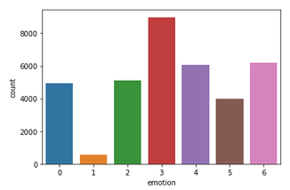
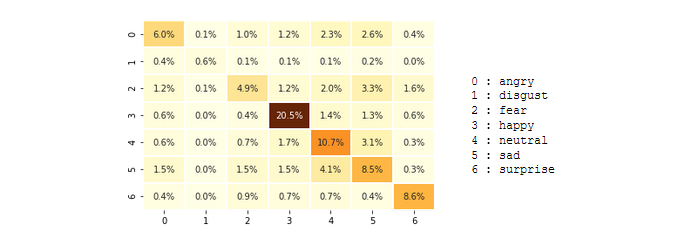

# P22_Emotions
face detection, MTCNN, Custom CNN, facial expression recognition

!(intro)[intro.png]

### Objectifs : 

En fonction de l'expression du visage, reconnaître l'émotions correspondante parmis les suivantes :
- heureux
- surpris
- triste
- en colère
- dégoûté
- effrayé
- neutre

Le modèle doit reconnaître les visages et leurs expressions sur une image (plusieurs visages), ou sur un flux steaming (webcam, 1 seul visage).  
Sur la détection webcam, le modèle doit afficher l'emoji correspondant à l'émotion, et poser des questions en fonction de l'Emotion détectée.

### Résolution :

Plusieurs tentatives on été faites pour la reconnaissance de l'expression faciale par transfert d'apprentissage. Cependnat, aucun présultat n'étant vraiment probant, c'est finalement un CNN séquentiel qui a été réalisé de zéro et entrainé sur le Dataset fourni. 

On obtient un score final de 76%, ce qui semble plutôt bon compte tenu des disparités dans la répartition des images : 

En effet, On a une grosse majorité de "Happy", "Sad" et "Neutral", et très peu de "Disgust".

La matrice de confusion obtenue reflète bien cette répartition :

### Résultats :

##### - _de la reconnaissance des visages :_
Avec le CNN construit "from scratch", après deux entraînements relativements longs (effectués sur Colab) avec des hyperparamètres différents, on obtient un score final stable à 76%.

Le modèle ne reconnaît pas l'expression du "dégoût", mais il est très probable que cela vienne du fait que le dataset d'etraînement contient très peu d'images de cette catégorie. Il faudrait envisager d'augmenter le dataset pour viser un score supérieur à celui-ci.

D'autres tentatives on été faites par transfert d'apprentissage, notamment avec VGG-Face, mais les résultats étaient moins bons.

##### - _de la détection/reconnaissance sur les photographies :_
Le modèle de détection choisi, MTCNN, donne des résultats meilleurs que HaarCascade sur les photos. Voir le notebook 2.

##### - _de la détection/reconnaissance sur le flux streaming :_
Techniquement, si MTCNN est plus précis et plus complet que HaarCascade (il reconnaît des visages dans des conditions où HarrCascade ne les voit pas), il est également plus lourd et moins rapide. Il semble donc moins adapté à la reconnaissance des visages sur le flux streaming. 
Cependant, HaarCascade a tendance à "décrocher" de temps à autres, ce qui rend la reconnaissance de l'émotion plus aléatoire. On présente donc dans le notebook 2 les résultats obtenus avec MTCNN.
